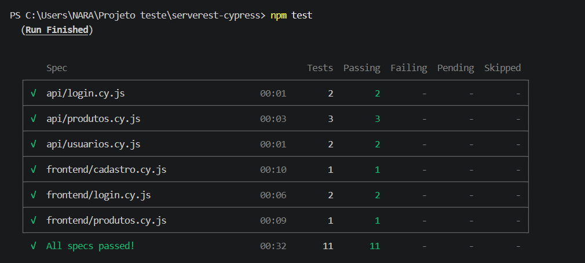
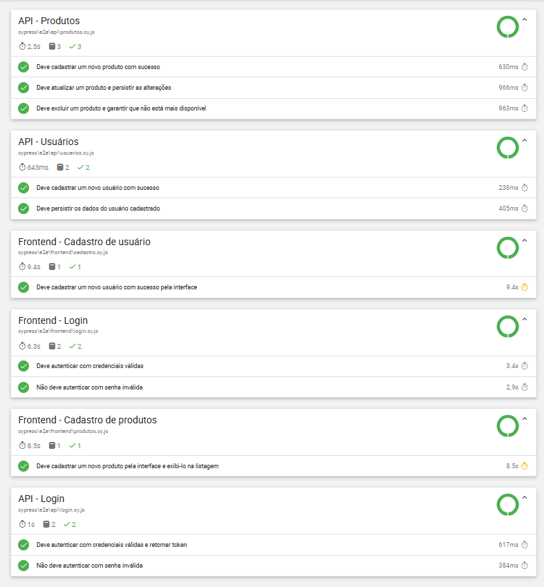
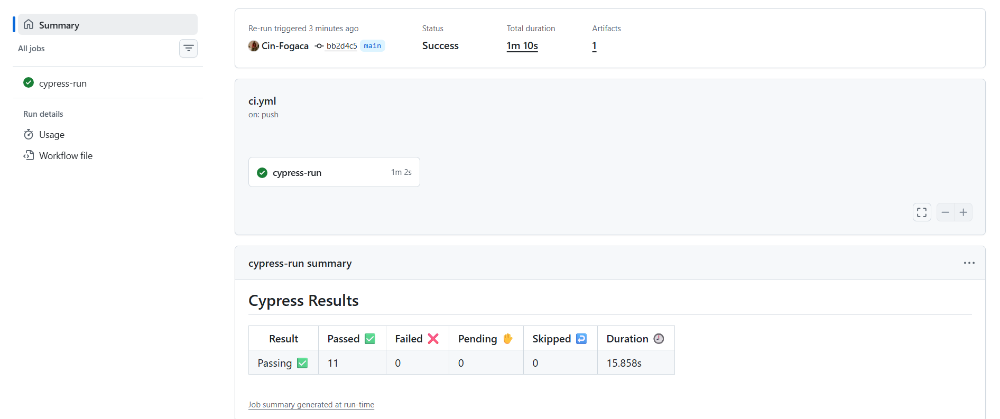

# Desafio de Automação — Cinthia Fogaça

Projeto de testes automatizados E2E (frontend) e de API da aplicação
[ServeRest](https://serverest.dev), desenvolvido com **Cypress + JavaScript**
como parte de um desafio técnico de QA.


## Objetivo

Cobrir os principais fluxos da aplicação com 3 cenários de teste de API e
3 cenários E2E de frontend, priorizando testes independentes, dados dinâmicos
e assertivas que validem comportamento de ponta a ponta (status, mensagens,
redirecionamentos e persistência dos dados).

## Stack

- [Cypress](https://www.cypress.io/) — framework de testes (frontend e API via `cy.request()`)
- [Faker](https://fakerjs.dev/) — geração de massa de dados dinâmica
- [Mochawesome](https://github.com/adamgruber/mochawesome) — relatório HTML de execução
- ESLint + Prettier — padronização e qualidade de código
- GitHub Actions — execução contínua dos testes a cada push

## Estrutura do projeto

```
cypress/
├── e2e/
│   ├── api/        # testes de API (usuários, login, produtos)
│   └── frontend/   # testes E2E de interface (cadastro, login, produtos)
├── factories/      # geração de dados dinâmicos (usuários e produtos)
├── pages/          # page objects das telas do frontend
├── services/       # camada de requisições à API (reutilizada pelos dois tipos de teste)
└── support/        # configurações de suporte do Cypress
```

### Decisões de arquitetura

- **Camada de services:** todas as chamadas HTTP ficam centralizadas em
  services, que são usados tanto pelos testes de API quanto pelos testes de
  frontend para **preparação de massa** (ex.: o teste de login de tela cria o
  usuário via API antes) e **limpeza de dados** ao final de cada cenário.
- **Page Objects:** os testes de frontend não conhecem seletores — apenas
  ações de página. Os seletores usam os atributos `data-testid` fornecidos
  pela própria aplicação.
- **Dados 100% dinâmicos:** nenhum teste depende de dado pré-existente.
  Usuários e produtos são gerados pelo Faker a cada execução, o que permite
  rodar a suíte repetidas vezes sem conflito (e-mails e nomes de produto
  duplicados são rejeitados pelo ServeRest — por isso os nomes de produto
  recebem um sufixo aleatório).
- **Esperas determinísticas:** o projeto proíbe `cy.wait()` com tempo fixo
  via regra de ESLint (`cypress/no-unnecessary-waiting`). Esperas são feitas
  por condição (ex.: URL após redirect de login), com timeout estendido
  apenas onde o ambiente público do ServeRest se mostrou mais lento.

## Como executar

Pré-requisitos: Node.js 18+ e npm.

```bash
# clonar o repositório
git clone https://github.com/Cin-Fogaca/serverest-cypress.git
cd serverest-cypress

# instalar as dependências
npm install
```

| Comando                 | O que faz                                  |
| ----------------------- | ------------------------------------------ |
| `npm test`              | executa todos os testes (API + frontend)   |
| `npm run test:api`      | executa apenas os testes de API            |
| `npm run test:frontend` | executa apenas os testes E2E de frontend   |
| `npm run cy:open`       | abre o Cypress em modo interativo          |
| `npm run lint`          | verifica a qualidade do código com ESLint  |
| `npm run format`        | formata o código com Prettier              |

## Relatório de testes

Após qualquer execução via `npm test`, o relatório HTML é gerado em
`cypress/reports/index.html`. Na pipeline do GitHub Actions, o relatório
fica disponível como artefato de cada execução (aba Actions → execução →
Artifacts).

## Observações sobre massa de dados

- Toda massa é criada pelos próprios testes (via factories + services) e
  removida ao final de cada cenário (`afterEach`), mantendo o ambiente limpo.
- O ServeRest é um ambiente público e compartilhado: os dados são resetados
  periodicamente pela própria aplicação e a latência pode oscilar entre
  execuções.

## Evidências de execução

**Execução local — todos os testes passando:**



**Relatório Mochawesome:**



**Pipeline no GitHub Actions:**


